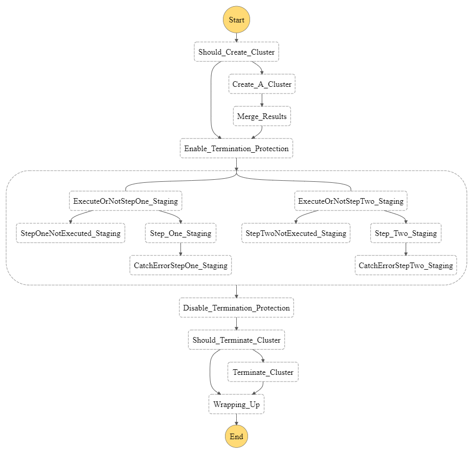

# etl-spark-parallel-stepfunctions
Execute EMR Jobs in parallel


# Architecture



# Input

## Create/Terminate Cluster and run all steps

```json
{
    "CreateCluster": true,
    "TerminateCluster": true
}
```

OR 

```json
{
    "CreateCluster": true,
    "TerminateCluster": true,
    "Steps_Staging": {
      "StepOne": true,
      "StepTwo": true
    }
}
```

## Create/Terminate Cluster and run only step ONE

```json
{
    "CreateCluster": true,
    "TerminateCluster": true,
    "Steps_Staging": {
      "StepOne": true,
      "StepTwo": false
    }
}
```

## Use current cluster and execute all steps
```json
{
    "CreateCluster": false,
    "TerminateCluster": false,
    "ClusterId": "YOUR CLUSTER ID"
}
```
